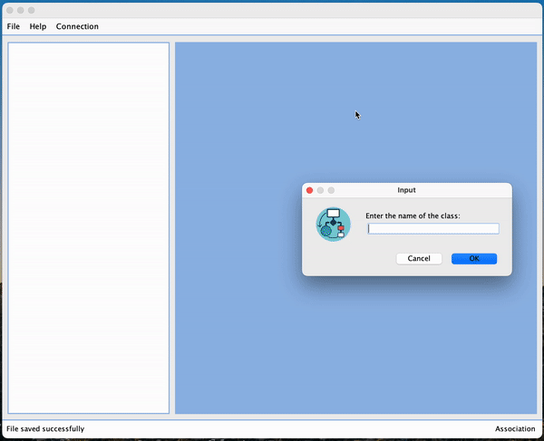

## UML Maker

A customizable cross-platform UML Design tool with Java source code generation

### Usage

#### macOS
Download the installer from [this link](https://drive.google.com/file/d/1rYkz-mwUHOYxSWxlbyORrKCc59FW5aA1/view?usp=sharing), install and run app to make and share simple UML diagrams.
If macOS does not permit opening the app, go to System Preferences > Security and Privacy > General pane > Click on the lock on the left bottom to make changes and allow UMLMaker.

Alternatively, you can follow steps 2-6 in the Custom Build section to build the app and installer on your own system, and you're all set :)

#### Windows
Download the zip from [this link](https://drive.google.com/file/d/1u4AaD-pZZASpIx6Go0v3Zp9ujGR0quBY/view?usp=sharing), extract and run UMLMaker.exe to make and share simple UML diagrams. 

Alternatively, you can follow steps 2-6 in the Custom Build section to build the exe on your own system, and you're all set :)

### Demo

### Custom Build

1. Customize the Java source code to accommodate your requirements
2. Compile the source and build the jar
3. Change the directory of the jar in the build.xml file
4. Make sure to set the directory of your java installation as JAVA_HOME in your environment

#### macOS
5. Run the script build_mac.sh to build the app as well as installer
6. You can find the installer in release/app/dmg. Use the installer to install your own custom UML Design Tool

#### Windows
5. Download launch4j from [this link](https://sourceforge.net/projects/launch4j/files/launch4j-3/3.14/) and extract it to the lib folder. Run the script build_windows.sh to build the exe and package as zip
6. You can find the EXE in release/windows. Run it to use your own custom UML design tool
